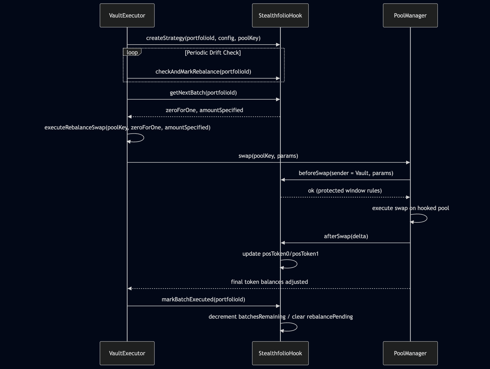

# Stealthfolio 

Stealthfolio is a Uniswap v4 hook that enables confidential, multi-asset portfolio rebalancing using Fhenix Fully Homomorphic Encryption (FHE). It is a Uniswap v4 rebalancing hook that transforms a v4 pool into a strategy-aware, protected execution lane for portfolio management.
It continuously monitors swap flow, detects allocation drift, plans rebalancing batches, and enforces execution guardrails. 

Stealthfolio is built in 2 parts: 
1. Public, Protected Rebalancing Hook 
2. Fully Private, FHE-Powered Rebalancing Hook

## Part 1 Stealthfolio - Public, Protected Rebalancing Hook 
Part 1 implements the complete strategy engine inside the hook, with all logic and parameters public.

Funds remain in a separate vault; the hook never holds assets.

### What Part 1 Does
- Tracks internal exposure via _afterSwap
- Computes allocation drift based on public strategy targets
- Decides when rebalancing is needed
- Plans multi-batch rebalancing
- Protects execution via _beforeSwap:
- the vault is always allowed to swap during rebalance
- large external swaps can be capped or blocked
- Tracks rebalance progress

## High Level Architecture

## Sequence Diagram

## Part 2 Stealthfolio - Fully Private, FHE-Powered Rebalancing Hook
Part 2 keeps the exact same architecture but makes the strategy private.
All strategy parameters, computations, and decisions are encrypted using Fully Homomorphic Encryption (FHE).

What Becomes Encrypted in V2
- Target allocations
- Drift thresholds
- Batch sizing
- Internal positions
- Deviations
- Rebalance decisions
- Execution schedule and direction