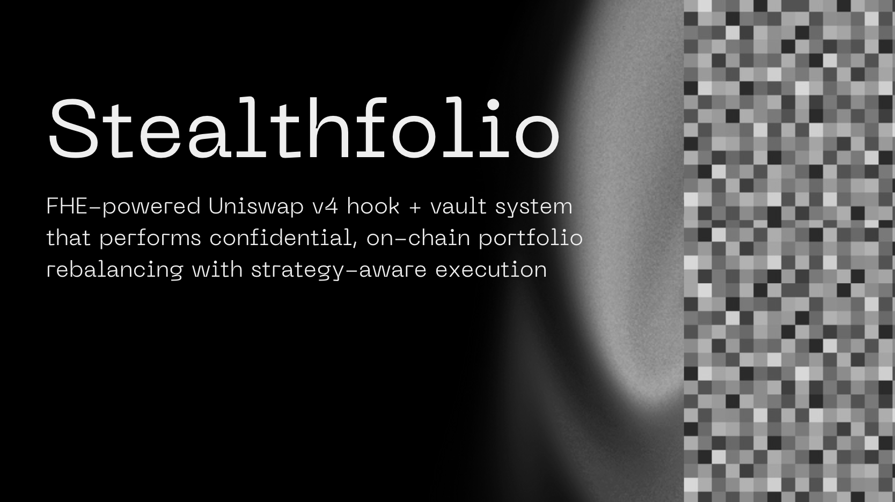
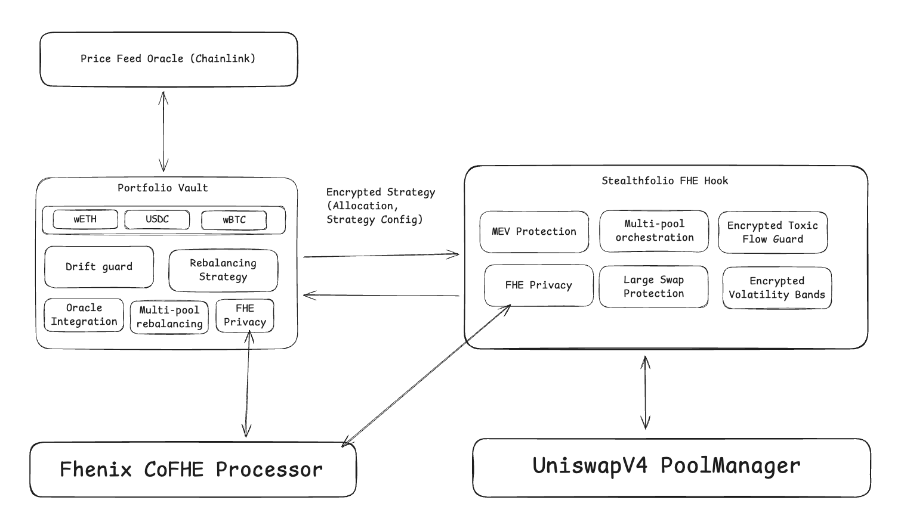
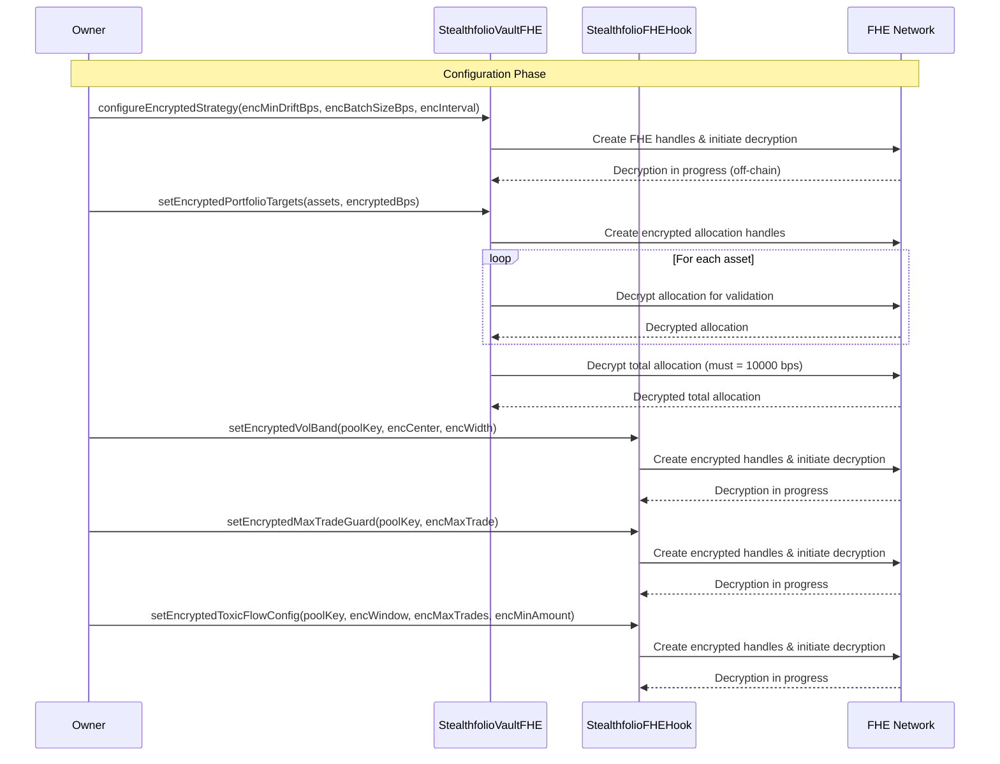
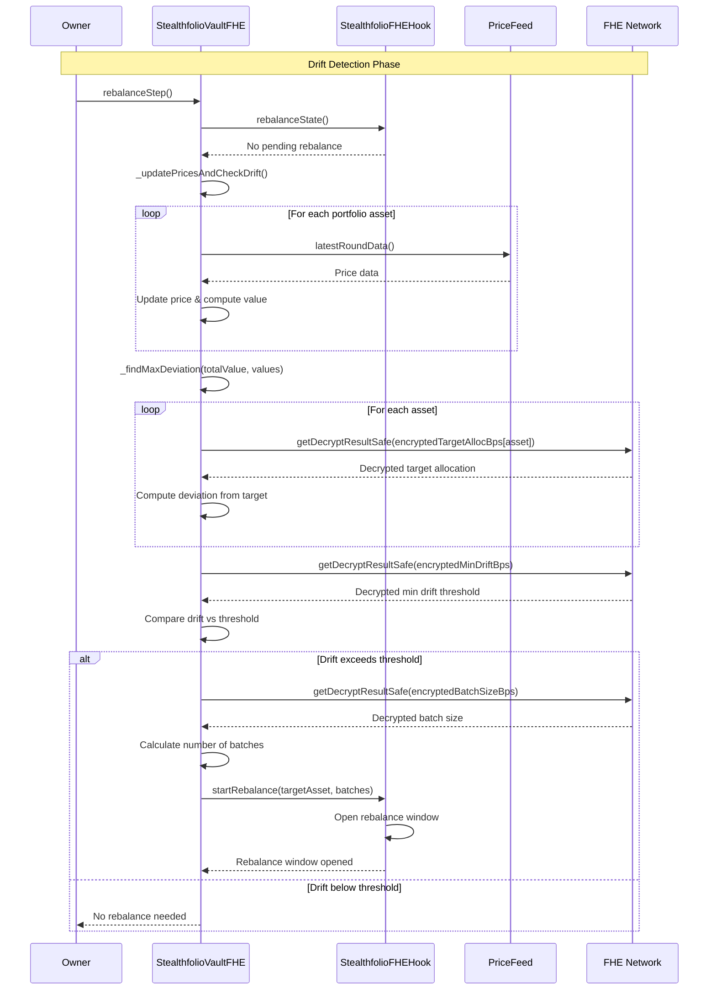
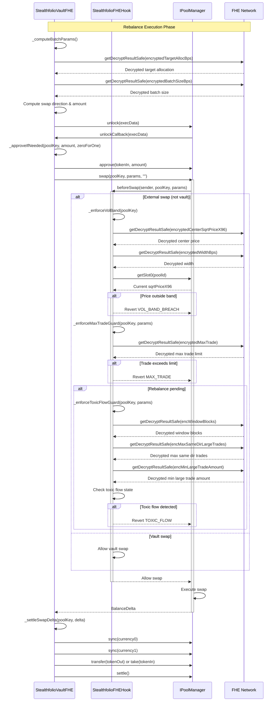
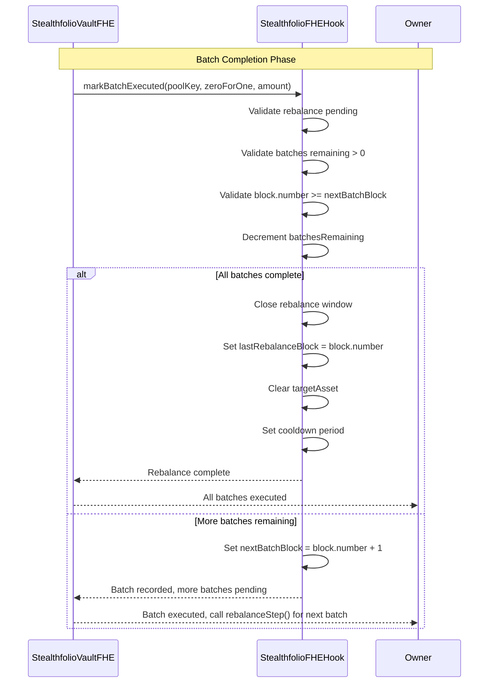
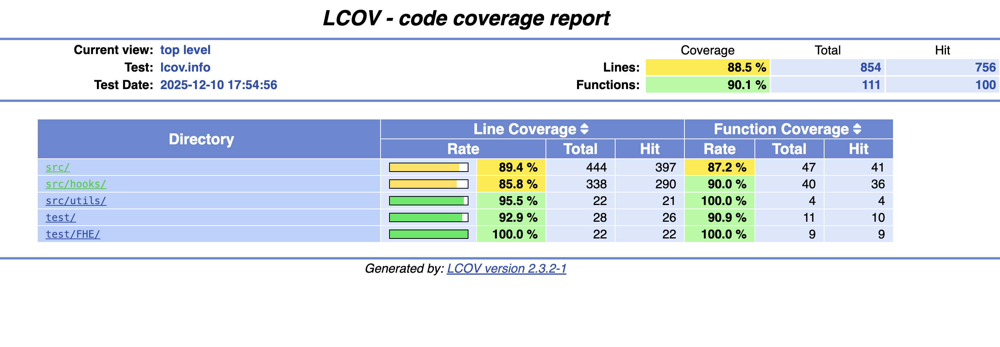
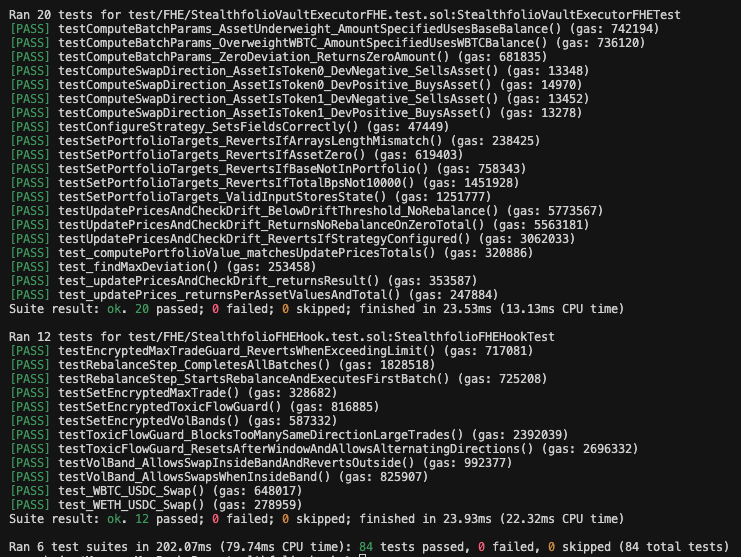

# Stealthfolio 

Stealthfolio is a Uniswap v4 hook + vault system that enables confidential, multi-asset portfolio rebalancing using Fhenix Fully Homomorphic Encryption (FHE). It is a Uniswap v4 rebalancing hook that transforms a v4 pool into a strategy-aware, protected execution lane for portfolio management.
It continuously monitors swap flow, detects allocation drift, plans rebalancing batches, and enforces execution guardrails. 



## 🏆 Top 8 Projects of Uniswap Hook Incubator Cohort 7 🏆 

Presented during Demo Day UHI 7: https://www.youtube.com/watch?v=-P-bLlCtl6E

​​​Judges include investors at a16z, Variant Fund, Dragonfly Capital, USV and Uniswap Foundation.

## Problem to Solve

Portfolio rebalancing strategies face several critical challenges when deployed on public blockchains:

**Strategy Exposure**: Traditional on-chain rebalancing systems expose all strategy parameters publicly, including target allocations, drift thresholds, and batch sizes. This transparency allows competitors and attackers to:
- Copy successful strategies
- Predict rebalancing actions before execution
- Front-run rebalancing trades for profit

**MEV and Front-Running**: When rebalancing parameters are visible, sophisticated actors can:
- Monitor strategy state and predict upcoming trades
- Extract value by front-running rebalancing swaps
- Cause slippage and increase execution costs for the strategy

**Toxic Flow and Manipulation**: During rebalancing windows, malicious actors can:
- Execute large trades in the same direction to manipulate prices
- Create artificial volatility to trigger false rebalancing signals
- Exploit predictable rebalancing patterns for profit

**Lack of Confidential Execution**: Existing DeFi protocols require all strategy logic to be transparent, making it impossible to maintain competitive advantages or protect proprietary allocation strategies.

**Multi-Asset Portfolio Management**: Managing complex multi-asset portfolios on AMMs requires:
- Coordinated rebalancing across multiple pools
- Protection mechanisms during execution windows
- Efficient batch execution to minimize market impact

## Solution

Stealthfolio addresses these challenges by combining Uniswap v4 hooks with Fully Homomorphic Encryption (FHE) to create a confidential, protected rebalancing system:

**Confidential Strategy Parameters**: All strategy parameters, including target allocations, drift thresholds, and batch sizes, are encrypted using FHE. This ensures strategy details remain private while still enabling on-chain computation.

**Protected Execution Windows**: The hook enforces multiple layers of safeguards during rebalancing:
- Volatility bands prevent trading in manipulated markets
- Max trade guards limit individual trade sizes
- Toxic flow detection prevents directional manipulation

**MEV Resistance**: By keeping strategy parameters encrypted, the system prevents front-runners from predicting rebalancing actions. The vault can execute rebalancing trades without exposing its strategy in advance.

**Multi-Batch Execution**: Large deviations are automatically split into multiple batches, minimizing market impact and reducing the risk of price manipulation.

**Vault Isolation**: Funds remain in a separate vault contract, ensuring the hook never holds assets and maintaining clear separation of concerns.

Stealthfolio is built in 2 parts: 
1. Public, Protected Rebalancing Hook 
2. Fully Private, FHE-Powered Rebalancing Hook

## Part 1 Stealthfolio - Public, Protected Rebalancing Hook 

Part 1 implements the complete rebalancing system with all strategy parameters and logic publicly visible on-chain. This version serves as the foundation, allowing clear implementation and testing of the core logic and math before adding privacy features in Part 2.

### Key Difference from Part 2

The main difference is that all strategy parameters are stored as **public state variables** instead of encrypted values:

- **Strategy parameters**: `minDriftBps`, `batchSizeBps`, `targetAllocBps` are all public
- **Safeguard parameters**: `centerSqrtPriceX96`, `widthBps`, `maxAmount`, `windowBlocks`, etc. are all public
- **No FHE encryption**: All values are directly readable on-chain

The architecture, workflow, and functionality are identical to Part 2. See Part 2 below for the complete detailed explanation of how the system works.

## Part 2 Stealthfolio - Fully Private, FHE-Powered Rebalancing Hook

Part 2 implements the complete FHE-powered rebalancing system. It maintains the same architecture and workflow as Part 1 but makes all strategy parameters, computations, and decisions private using Fully Homomorphic Encryption (FHE). This section provides the detailed explanation of how the system works.

### Architecture

The FHE implementation consists of two main contracts:

**StealthfolioFHEHook**: The Uniswap v4 hook that enforces encrypted safeguards and coordinates rebalancing windows. It intercepts swaps via `beforeSwap` and applies protection rules while allowing vault swaps during rebalance periods.

**StealthfolioVaultExecutorFHE**: The vault contract that holds funds and executes the rebalancing strategy. It manages encrypted strategy configuration, computes drift using encrypted parameters, and executes rebalancing batches through the pool manager.

### Encrypted Strategy Parameters

All sensitive strategy parameters are encrypted using FHE and stored as encrypted types (euint16, euint32, euint128, euint256):

**Vault Strategy Configuration:**
- Target allocations per asset (encryptedTargetAllocBps)
- Minimum drift threshold in basis points (encryptedMinDriftBps)
- Batch size in basis points (encryptedBatchSizeBps)
- Minimum drift check interval in blocks (encryptedMinDriftCheckInterval)

**Hook Safeguards:**
- Volatility band center price and width (encryptedCenterSqrtPriceX96, encryptedWidthBps)
- Maximum trade size limits (encryptedMaxTrade)
- Toxic flow detection parameters:
  - Window length in blocks (encWindowBlocks)
  - Maximum same-direction large trades (encMaxSameDirLargeTrades)
  - Minimum large trade threshold (encMinLargeTradeAmount)

### How It Works

1. **Configuration**: The owner sets encrypted strategy parameters and portfolio targets. FHE handles are created and decryption is initiated off-chain via threshold decryption.

2. **Drift Detection**: The vault periodically updates prices from oracles and computes portfolio drift. It decrypts encrypted parameters on-demand to compare current allocations against encrypted targets.

3. **Rebalance Initiation**: When drift exceeds the encrypted threshold, the vault calls `startRebalance` on the hook, opening a rebalancing window.

4. **Batch Execution**: The vault computes batch swap parameters using encrypted batch sizing, then executes swaps through the pool manager. The hook allows vault swaps while enforcing safeguards on external swaps.

5. **Safeguard Enforcement**: During rebalancing, the hook enforces:
   - Volatility bands: Blocks trades if price moves outside encrypted price bands
   - Max trade guards: Limits trade sizes to encrypted maximums
   - Toxic flow detection: Prevents repeated large trades in the same direction within encrypted windows

6. **Completion**: After all batches execute, the rebalance window closes and a cooldown period begins before the next rebalance can start.

### Key Features

- **Complete Privacy**: Strategy parameters, allocations, and thresholds remain encrypted on-chain
- **On-Chain Computation**: FHE enables computation on encrypted data without decryption
- **Execution Protection**: Multiple layers of encrypted safeguards prevent manipulation and toxic flow
- **Vault Isolation**: Funds remain in a separate vault contract; the hook never holds assets
- **Multi-Batch Rebalancing**: Large deviations are rebalanced across multiple batches to minimize market impact
- **Cooldown Management**: Prevents excessive rebalancing with configurable cooldown periods

### Security Model

The system uses threshold decryption where encrypted values are decrypted off-chain by a network of FHE nodes. Once decrypted, the plaintext values are available for on-chain computation while the original encrypted handles remain for future operations. This allows the system to work with encrypted data while still enabling efficient on-chain execution.


## High Level Architecture



## FHE Integration with Fhenix

Stealthfolio integrates with [Fhenix](https://fhenix.io/) to provide Fully Homomorphic Encryption (FHE) capabilities. Fhenix enables on-chain computation on encrypted data without requiring decryption, allowing strategy parameters to remain confidential while still being usable in smart contract logic.

All sensitive strategy parameters are encrypted using Fhenix's encrypted integer types (`euint16`, `euint32`, `euint128`, `euint256`). These encrypted values can be used in computations after threshold decryption, which occurs off-chain through Fhenix's network of FHE nodes.

### Encrypted Vault Strategy Parameters

The vault stores encrypted strategy configuration that determines when and how rebalancing occurs:

```solidity
struct EncryptedStrategyConfig {
    euint32 encryptedMinDriftBps;        // Minimum drift threshold in basis points before rebalancing
    euint32 encryptedBatchSizeBps;      // Per-batch fraction of deviation (basis points)
    euint32 encryptedMinDriftCheckInterval; // Minimum blocks between drift checks
    bool enabled;
}

// Encrypted target allocations per asset
mapping(Currency => euint16) public encryptedTargetAllocBps; // Currency -> allocation in basis points
euint16 public encryptedTotalAllocBps; // Total allocation sum (must equal 10,000 bps)
```

**Why encrypted**: These parameters reveal the rebalancing strategy. Keeping them encrypted prevents competitors from copying the strategy and attackers from front-running rebalancing actions.

### Encrypted Hook Safeguards

The hook enforces three layers of encrypted safeguards to protect against manipulation during rebalancing:

**Volatility Bands** - Prevents trading in manipulated markets:
```solidity
struct VolBand {
    euint256 encryptedCenterSqrtPriceX96;  // Encrypted center price (sqrtPriceX96 format)
    euint32 encryptedWidthBps;             // Encrypted width in basis points (e.g., 500 = ±5%)
    bool enabled;
}
```

**Max Trade Guards** - Limits individual trade sizes:
```solidity
struct MaxTradeGuard {
    euint128 encryptedMaxTrade;  // Encrypted maximum trade size
    bool enabled;
}
```

**Toxic Flow Detection** - Prevents directional manipulation:
```solidity
struct ToxicFlowConfig {
    bool enabled;
    euint32 encWindowBlocks;              // Encrypted window length in blocks
    euint32 encMaxSameDirLargeTrades;     // Encrypted maximum same-direction trades
    euint256 encMinLargeTradeAmount;      // Encrypted threshold for "large" trade detection
}
```

**Why encrypted**: Safeguard parameters reveal protection thresholds. Encrypting them prevents attackers from probing the system to find safe manipulation windows.


## Sequence Diagram
### 1. Configuration Phase 



### 2. Drift Detection Phase


### 3. Rebalance Execution Phase


### 4. Batch Completion Phase


## Test Coverage

### Running Coverage Tests

```bash
forge coverage --report lcov --ir-minimum && genhtml lcov.info --output-dir coverage_report
```




- Key functionalities tested
- 90% test coverage

## Quick Start

### Prerequisites

- [Foundry](https://book.getfoundry.sh/getting-started/installation) (latest version)
- Git
- Node.js (for frontend, if applicable)

### Installation

1. **Clone the repository**
   ```bash
   git clone <repository-url>
   cd Stealthfolio
   ```

2. **Install dependencies**
   ```bash
   cd stealthfolio-hook
   forge install
   ```

3. **Build the project**
   ```bash
   forge build
   ```

4. **Run tests**
   ```bash
   forge test
   ```

5. **Run tests with verbosity** (for detailed output)
   ```bash
   forge test -vvv
   ```

### Project Structure

```
Stealthfolio/
├── assets/                    # Images and visual assets
├── frontend/                  # Frontend landing page (React + Vite)
├── stealthfolio-hook/        # Main Foundry project
│   ├── src/
│   │   ├── hooks/
│   │   │   └── StealthfolioFHEHook.sol      # FHE-powered hook implementation
│   │   ├── v1Stealthfolio/                   # Part 1: Public rebalancing system
│   │   │   ├── StealthfolioHook.sol         # Public hook implementation
│   │   │   └── StealthfolioVaultExecutor.sol # Public vault executor
│   │   ├── StealthfolioVaultExecutorFHE.sol  # Part 2: FHE-powered vault executor
│   │   └── utils/
│   │       └── CalculatePrice.sol           # Price calculation utilities
│   ├── test/
│   │   ├── v1Stealthfolio/                   # Tests for Part 1 (public)
│   │   │   ├── StealthfolioHook.test.sol
│   │   │   └── StealthfolioVaultExecutor.test.sol
│   │   ├── v2FHEStealthfolio/                # Tests for Part 2 (FHE)
│   │   │   ├── StealthfolioFHEHook.test.sol
│   │   │   └── StealthfolioVaultExecutorFHE.test.sol
│   │   ├── oracle/
│   │   │   └── MockPriceFeed.test.sol        # Mock oracle tests
│   │   └── utils/
│   │       └── CalculatePrice.test.sol       # Utility tests
│   ├── lib/                   # Dependencies (installed via `forge install`)
│   ├── script/                # Deployment scripts
│   ├── foundry.toml           # Foundry configuration
│   └── remappings.txt         # Solidity import remappings
└── README.md                  # This file
```

## Dependencies

### Core Dependencies

- **Solidity**: `0.8.26`
- **EVM Version**: `cancun`
- **Foundry**: Latest version (for development, testing, and deployment)

### Key Libraries

- **[Uniswap v4 Core](https://github.com/Uniswap/v4-core)** - Uniswap v4 pool manager and core contracts
- **[Uniswap v4 Periphery](https://github.com/Uniswap/v4-periphery)** - Uniswap v4 periphery contracts and utilities
- **[Fhenix FHE Contracts](https://fhenix.io/)** - Fully Homomorphic Encryption contracts for confidential computation
  - `@fhenixprotocol/cofhe-contracts` - FHE contract interfaces
  - `@fhenixprotocol/cofhe-mock-contracts` - Mock FHE contracts for testing
- **[Chainlink Contracts](https://github.com/smartcontractkit/chainlink)** - Mock Price feed oracles for portfolio valuation
- **[OpenZeppelin Contracts](https://github.com/OpenZeppelin/openzeppelin-contracts)** - Security-focused smart contract library
- **[Forge Std](https://github.com/foundry-rs/forge-std)** - Standard library for Foundry testing

### Installation

All dependencies are managed via Foundry's git submodule system. They are automatically installed when you run:

```bash
forge install
```

Dependencies are located in the `stealthfolio-hook/lib/` directory.

## Resources
- [Youtube Demo](https://youtu.be/Extc4t-mvD4?si=xcXtQTI3ltP55g8F)
- [Canva Slides](https://www.canva.com/design/DAG6Qmoy0Xo/RmiwKo1--60D8_EoSrdygw/edit?utm_content=DAG6Qmoy0Xo&utm_campaign=designshare&utm_medium=link2&utm_source=sharebutton)