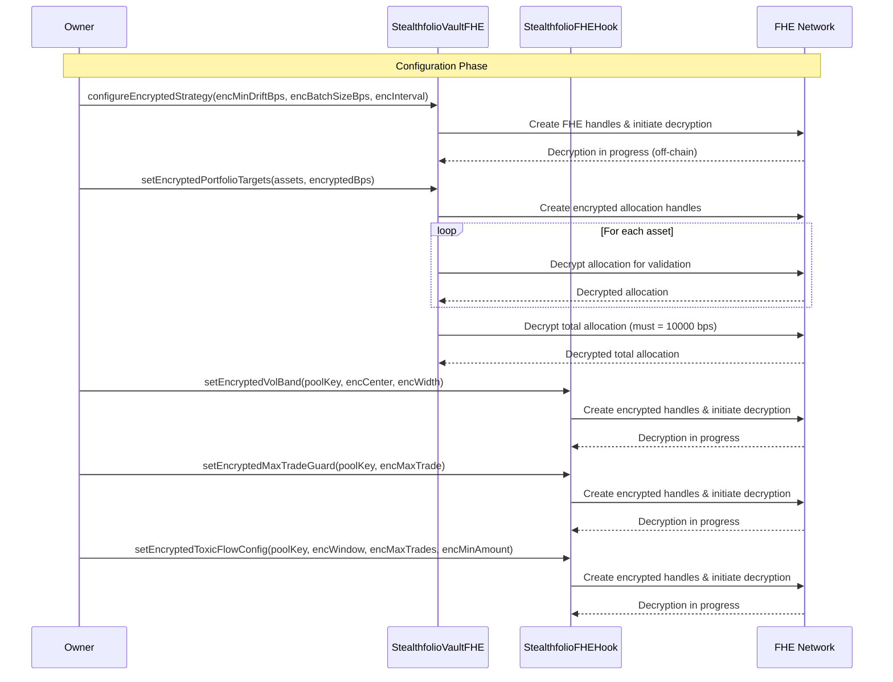
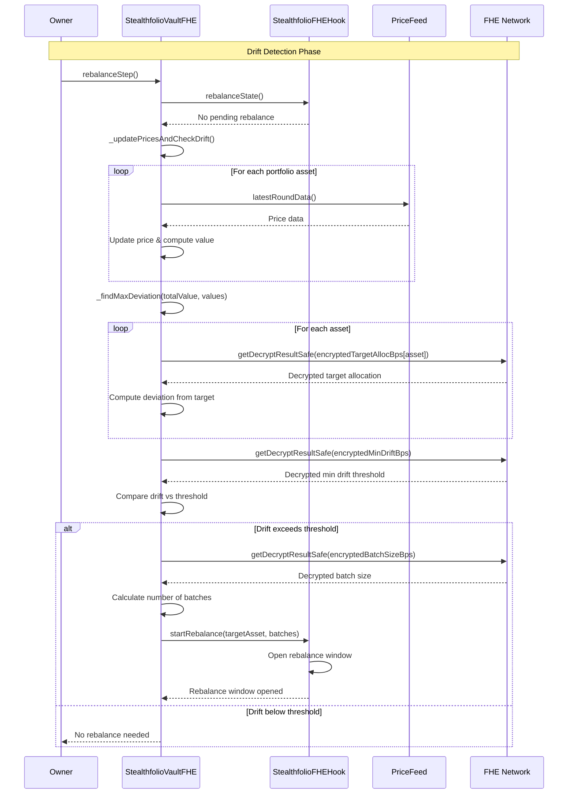
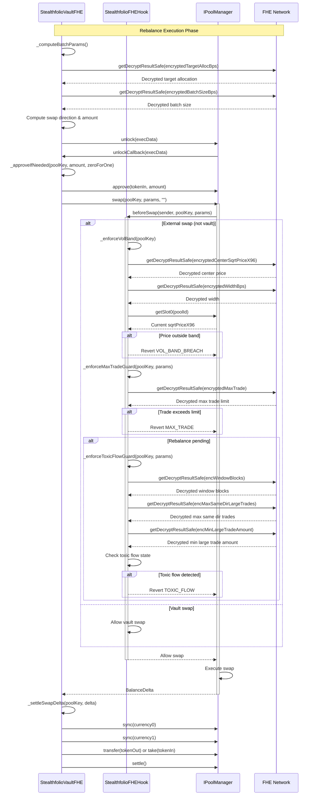
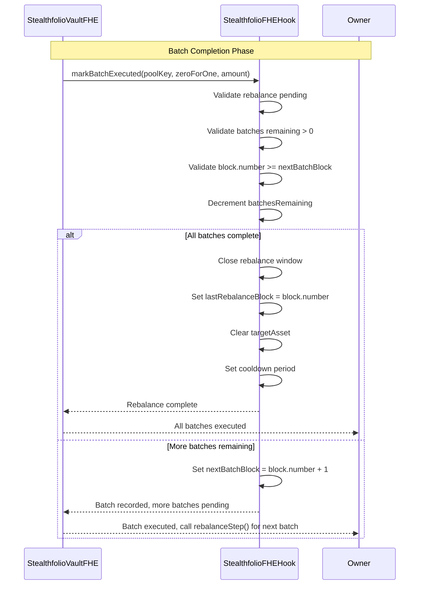

# Stealthfolio 

Stealthfolio is a Uniswap v4 hook that enables confidential, multi-asset portfolio rebalancing using Fhenix Fully Homomorphic Encryption (FHE). It is a Uniswap v4 rebalancing hook that transforms a v4 pool into a strategy-aware, protected execution lane for portfolio management.
It continuously monitors swap flow, detects allocation drift, plans rebalancing batches, and enforces execution guardrails. 

Stealthfolio is built in 2 parts: 
1. Public, Protected Rebalancing Hook 
2. Fully Private, FHE-Powered Rebalancing Hook

## Part 1 Stealthfolio - Public, Protected Rebalancing Hook 

Part 1 implements the complete rebalancing system with all strategy parameters and logic publicly visible on-chain. Building this part first allows clear implementation and testing of the core logic and math before adding privacy features.

### Architecture

The Part 1 implementation consists of two main contracts:

**StealthfolioHook**: The Uniswap v4 hook that enforces execution safeguards and coordinates rebalancing windows. It intercepts swaps via `beforeSwap` and applies protection rules while allowing vault swaps during rebalance periods.

**StealthfolioVault**: The vault contract that holds funds and executes the rebalancing strategy. It manages strategy configuration, computes drift using oracle prices, and executes rebalancing batches through the pool manager.

### Strategy Configuration

All strategy parameters are stored as public state variables:

**Vault Strategy Configuration:**
- Target allocations per asset (targetAllocBps) - public mapping
- Minimum drift threshold in basis points (minDriftBps)
- Batch size in basis points (batchSizeBps)
- Minimum drift check interval in blocks (minDriftCheckInterval)

**Hook Safeguards:**
- Volatility band center price and width (centerSqrtPriceX96, widthBps) - blocks trades outside price bands
- Maximum trade size limits (maxAmount) - caps individual trade sizes
- Toxic flow detection parameters:
  - Window length in blocks (windowBlocks)
  - Maximum same-direction large trades (maxSameDirLargeTrades)
  - Minimum large trade threshold (minLargeTradeAmount)

### How It Works

1. **Configuration**: The owner sets strategy parameters and portfolio targets. All values are stored as public state, making the strategy fully transparent.

2. **Drift Detection**: The vault periodically updates prices from Chainlink oracles and computes portfolio drift. It compares current allocations against target allocations to find the asset with maximum deviation.

3. **Rebalance Initiation**: When drift exceeds the minimum threshold, the vault calls `startRebalance` on the hook, opening a rebalancing window with a specified number of batches.

4. **Batch Execution**: The vault computes batch swap parameters using the configured batch size, then executes swaps through the pool manager. The hook allows vault swaps while enforcing safeguards on external swaps.

5. **Safeguard Enforcement**: During rebalancing, the hook enforces:
   - Volatility bands: Blocks trades if price moves outside configured price bands
   - Max trade guards: Limits trade sizes to configured maximums
   - Toxic flow detection: Prevents repeated large trades in the same direction within configured windows

6. **Completion**: After all batches execute, the rebalance window closes and a cooldown period begins before the next rebalance can start.

### Key Features

- **Public Strategy**: All parameters and allocations are visible on-chain for transparency
- **Execution Protection**: Multiple layers of safeguards prevent manipulation and toxic flow
- **Vault Isolation**: Funds remain in a separate vault contract; the hook never holds assets
- **Multi-Batch Rebalancing**: Large deviations are rebalanced across multiple batches to minimize market impact
- **Oracle Integration**: Uses Chainlink price feeds for accurate portfolio valuation
- **Cooldown Management**: Prevents excessive rebalancing with configurable cooldown periods

## Part 2 Stealthfolio - Fully Private, FHE-Powered Rebalancing Hook

Part 2 implements the complete FHE-powered rebalancing system. It maintains the same architecture as Part 1 but makes all strategy parameters, computations, and decisions private using Fully Homomorphic Encryption (FHE).

### Architecture

The FHE implementation consists of two main contracts:

**StealthfolioFHEHook**: The Uniswap v4 hook that enforces encrypted safeguards and coordinates rebalancing windows. It intercepts swaps via `beforeSwap` and applies protection rules while allowing vault swaps during rebalance periods.

**StealthfolioVaultExecutorFHE**: The vault contract that holds funds and executes the rebalancing strategy. It manages encrypted strategy configuration, computes drift using encrypted parameters, and executes rebalancing batches through the pool manager.

### Encrypted Strategy Parameters

All sensitive strategy parameters are encrypted using FHE and stored as encrypted types (euint16, euint32, euint128, euint256):

**Vault Strategy Configuration:**
- Target allocations per asset (encryptedTargetAllocBps)
- Minimum drift threshold in basis points (encryptedMinDriftBps)
- Batch size in basis points (encryptedBatchSizeBps)
- Minimum drift check interval in blocks (encryptedMinDriftCheckInterval)

**Hook Safeguards:**
- Volatility band center price and width (encryptedCenterSqrtPriceX96, encryptedWidthBps)
- Maximum trade size limits (encryptedMaxTrade)
- Toxic flow detection parameters:
  - Window length in blocks (encWindowBlocks)
  - Maximum same-direction large trades (encMaxSameDirLargeTrades)
  - Minimum large trade threshold (encMinLargeTradeAmount)

### How It Works

1. **Configuration**: The owner sets encrypted strategy parameters and portfolio targets. FHE handles are created and decryption is initiated off-chain via threshold decryption.

2. **Drift Detection**: The vault periodically updates prices from oracles and computes portfolio drift. It decrypts encrypted parameters on-demand to compare current allocations against encrypted targets.

3. **Rebalance Initiation**: When drift exceeds the encrypted threshold, the vault calls `startRebalance` on the hook, opening a rebalancing window.

4. **Batch Execution**: The vault computes batch swap parameters using encrypted batch sizing, then executes swaps through the pool manager. The hook allows vault swaps while enforcing safeguards on external swaps.

5. **Safeguard Enforcement**: During rebalancing, the hook enforces:
   - Volatility bands: Blocks trades if price moves outside encrypted price bands
   - Max trade guards: Limits trade sizes to encrypted maximums
   - Toxic flow detection: Prevents repeated large trades in the same direction within encrypted windows

6. **Completion**: After all batches execute, the rebalance window closes and a cooldown period begins before the next rebalance can start.

### Key Features

- **Complete Privacy**: Strategy parameters, allocations, and thresholds remain encrypted on-chain
- **On-Chain Computation**: FHE enables computation on encrypted data without decryption
- **Execution Protection**: Multiple layers of encrypted safeguards prevent manipulation and toxic flow
- **Vault Isolation**: Funds remain in a separate vault contract; the hook never holds assets
- **Multi-Batch Rebalancing**: Large deviations are rebalanced across multiple batches to minimize market impact
- **Cooldown Management**: Prevents excessive rebalancing with configurable cooldown periods

### Security Model

The system uses threshold decryption where encrypted values are decrypted off-chain by a network of FHE nodes. Once decrypted, the plaintext values are available for on-chain computation while the original encrypted handles remain for future operations. This allows the system to work with encrypted data while still enabling efficient on-chain execution.

## High Level Architecture

## Sequence Diagram

### Configuration Phase 

### Drift Detection Phase

### Rebalance Execution Phase

### Batch Completion Phase
